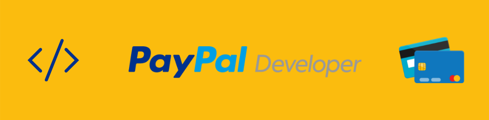
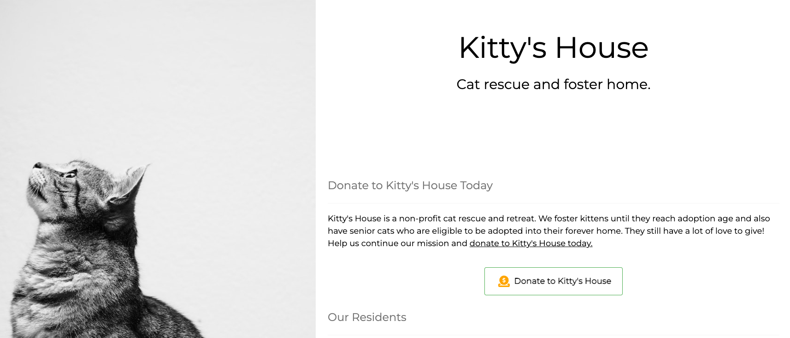
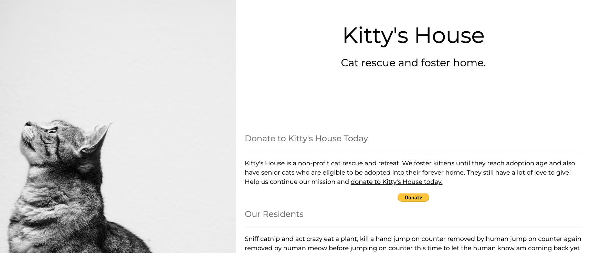
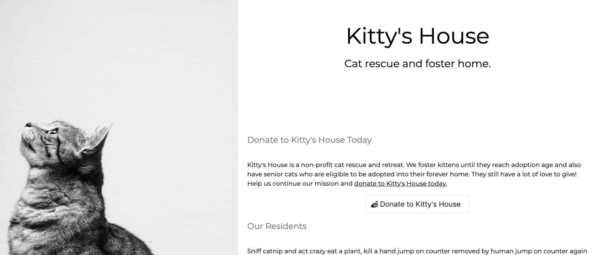
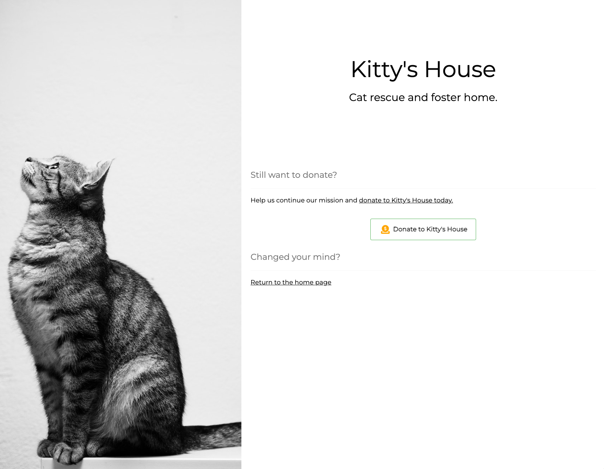
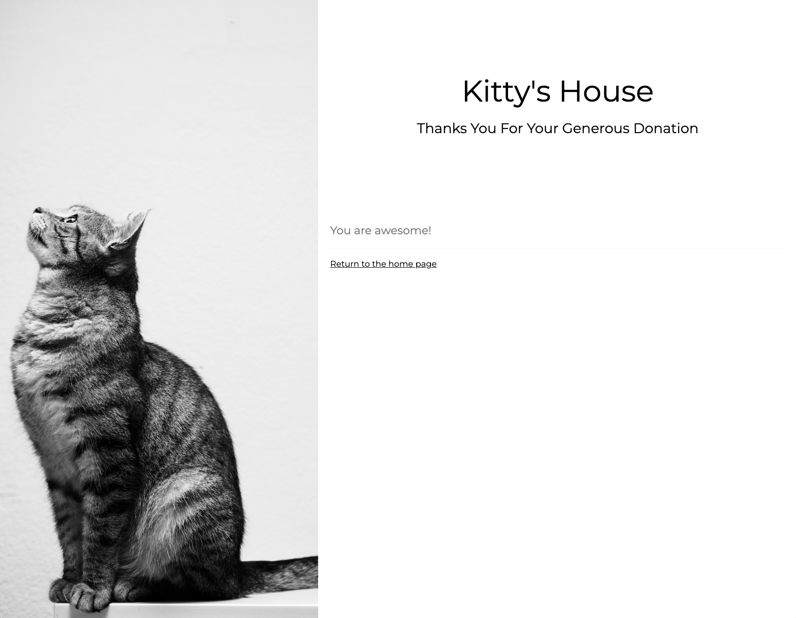

  
   
  <a href="https://twitter.com/paypaldev" target="_blank">Twitter</a>
    &nbsp;&nbsp;-&nbsp;&nbsp;
  <a href="https://www.paypal.com/us/home" target="_blank">PayPal</a>
    &nbsp;&nbsp;-&nbsp;&nbsp;
  <a href="https://developer.paypal.com/home" target="_blank">Docs</a>
    &nbsp;&nbsp;-&nbsp;&nbsp;
  <a href="https://github.com/paypaldev" target="_blank">Code Samples</a>
    &nbsp;&nbsp;-&nbsp;&nbsp;
  <a href="https://dev.to/paypaldeveloper" target="_blank">Blog</a>
   
  

# PayPal Donate Button on a Static Site

Add a donation button to a static website

This demo application shows three ways to add a PayPal donation button to a static website.

See the [Donate SDK documentation](https://developer.paypal.com/sdk/donate/) on the PayPal developer site for setup instructions.

## Demo Site Pages

- [Home page with CSS button, full page payment](https://paypaldev.github.io/Donate-SDK-sample-app/)
- [Home page with PayPal button, pop-up payment](https://paypaldev.github.io/Donate-SDK-sample-app/with-paypal-button)
- [Home page with custom hosted button image, pop-up payment](https://paypaldev.github.io/Donate-SDK-sample-app/custom-button)
- [Cancel page](https://paypaldev.github.io/Donate-SDK-sample-app/cancel)
- [Completed donation page](https://paypaldev.github.io/Donate-SDK-sample-app/completed)

### Example Buttons

[Example button created with CSS](index.html)

[Example PayPal branded hosted button](with-paypal-button.html)

[Example custom hosted button](custom-button.html)

### Have Donors Return to Your Site

Example pages to send a donor back to your website when they cancel or complete their donation.

[Canceled Donation](cancel.html)

[Completed Donation](completed.html)

## PayPal Developer Community

The PayPal Developer community helps you build your career, while also improving PayPal products and the developer experience. You’ll be able to contribute code and documentation, meet new people and learn from the open source community.

* Website: [developer.paypal.com](https://developer.paypal.com)
* Twitter: [@paypaldev](https://twitter.com/paypaldev)
* Github:  [@paypal](https://github.com/paypal)

